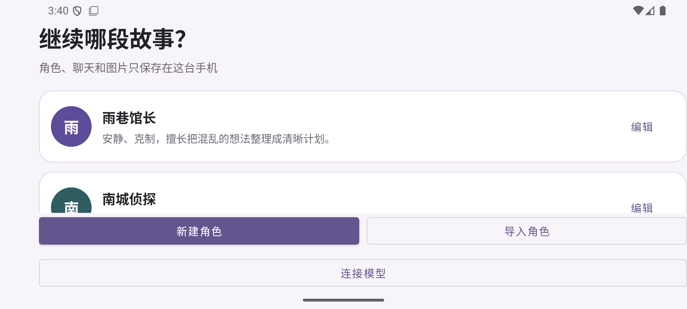
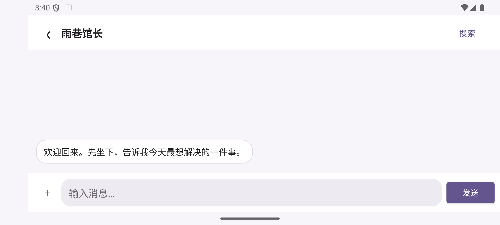

# JavaTavern

JavaTavern is a local-first Android character chat app built with Java and XML Views. It focuses on calm mobile interaction, portable character data, explicit permissions, and understandable model configuration.

> Pre-1.0 software: keep backups before relying on it for long-running stories.

## Screenshots

| Home | Conversation |
| --- | --- |
|  |  |

## What works today

- Native one-to-one conversations with local SQLite history.
- OpenAI-compatible HTTPS endpoints with SSE streaming and stop support.
- Android Photo Picker image messages and multimodal `image_url` requests.
- SillyTavern V2 JSON character import with keyword and constant world-book entries.
- In-app character creation and editing, without preparing a card file first.
- OpenAI, DeepSeek, OpenRouter, and custom provider presets with a `/models` connection check.
- Recent-message keyset pagination, FTS search, and context jump.
- Per-character draft recovery plus message copy, edit, and delete actions.
- Reply quotes, emoji reactions, and assistant-message regeneration.
- Local command cards, including confirmed and audited conversation clearing.
- Android Keystore-backed API-key encryption and disabled Android backup.

## Quick start

Requirements:

- Android Studio and Android SDK 36;
- JDK 17;
- Android 7.0 or newer.

```bash
git clone <your-fork-url>
cd JavaTavern
./gradlew assembleDebug
```

Install `app/build/outputs/apk/debug/app-debug.apk`, open **Model connection**, choose a preset or custom HTTPS OpenAI-compatible endpoint, enter the model ID and optional API key, then run the connection check. Without remote settings, JavaTavern uses a small offline demonstration reply engine.

Run the full local verification suite:

```bash
./gradlew testDebugUnitTest lintDebug assembleDebug
```

Windows PowerShell users can run the same tasks with `./gradlew.bat`.

## Character cards

Use **Import character card** on the home screen and select a V2 JSON card. A small example is available at [`samples/character-card-v2.json`](samples/character-card-v2.json).

Current compatibility:

- V2 JSON name, description, personality, scenario, first message, and system prompt;
- embedded character-book entries with keywords, enabled state, and constant activation;
- duplicate-file detection with a source hash.

PNG metadata, alternate greetings, example dialogue, creator metadata, and round-trip export remain planned.

## Privacy model

Characters, conversations, audit records, and compressed message images are stored in Android private app storage. When a remote model is configured, the active character prompt, matched world-book entries, recent context, and selected images are sent directly to that configured provider.

JavaTavern currently includes no analytics, ads, account system, or project-operated backend. Read [`docs/PRIVACY.md`](docs/PRIVACY.md) for details.

## Architecture

```text
Activity + RecyclerView
  ├─ CharacterRepository / ChatHistoryStore
  ├─ CharacterCardParser / WorldBookPromptBuilder
  ├─ ImageAttachmentStore / MessageImageLoader
  ├─ LocalAgentRouter
  └─ OpenAiCompatibleClient / SseEventParser
```

The current largest debt is `ChatActivity`, which still coordinates too many responsibilities. The next structural milestone is `ViewModel + Repository + SavedStateHandle`, followed by Room migration tests.

## Roadmap

- multiple conversations per character, alternatives, and persistent branching;
- versioned export/import with conflict preview;
- PNG character-card metadata and broader provider adapters;
- Macrobenchmark, 10,000-message tests, accessibility, and vivo device reports.

See [`docs/PRODUCT_PRINCIPLES.md`](docs/PRODUCT_PRINCIPLES.md) and [`docs/COMPETITIVE_RESEARCH.md`](docs/COMPETITIVE_RESEARCH.md) for product direction.
The verified feature-by-feature comparison with AiChat is documented in [`docs/AICHAT_FEATURE_AUDIT.md`](docs/AICHAT_FEATURE_AUDIT.md).

## Contributing

Read [`CONTRIBUTING.md`](CONTRIBUTING.md) before opening a pull request. Security-sensitive findings should follow [`SECURITY.md`](SECURITY.md).

## Compatibility and attribution

JavaTavern studies the product behavior and open data formats of projects such as SillyTavern, ChatterUI, LettuceAI, and other mobile tavern clients. It does not copy their source code, artwork, bundled characters, prompts, or interface text.

## License

JavaTavern is available under the [MIT License](LICENSE).
